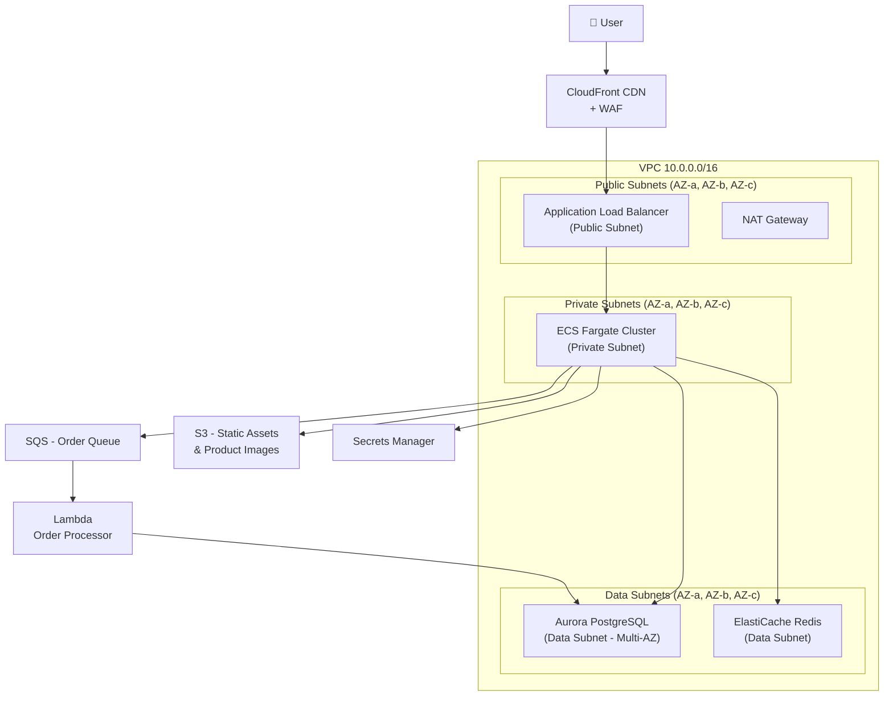
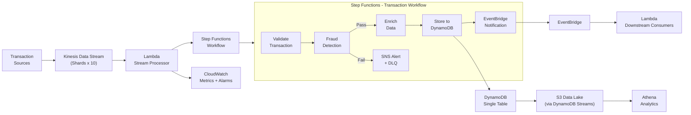
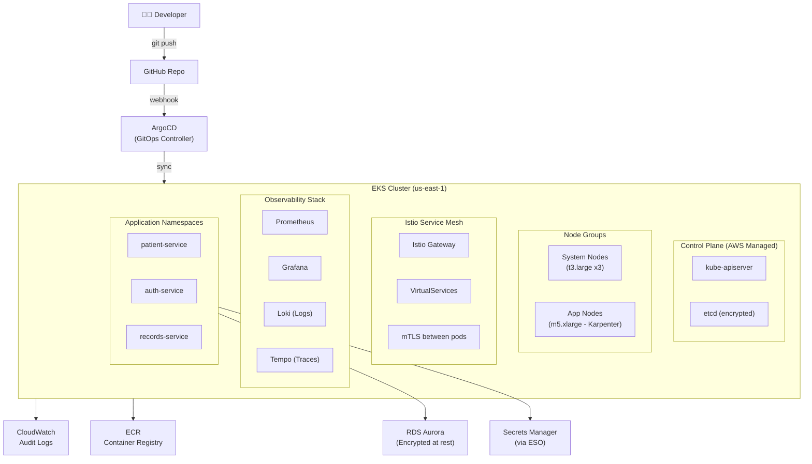

# AWS IaC Industry Projects

Three real-world industry projects with full architecture, codebase, and learning outcomes.

---

## Project 1: Multi-Tier E-Commerce Platform (Retail Industry)

### Goal
Deploy a production-grade, highly available e-commerce backend on AWS using Terraform with VPC, ECS Fargate, RDS Aurora, ElastiCache, and CloudFront.

### Learning Outcomes
- Design multi-AZ VPC with public/private/data subnet tiers
- Deploy containerized microservices on ECS Fargate
- Manage secrets with AWS Secrets Manager
- Implement CDN with CloudFront + WAF
- Use Terraform modules and remote state

### Architecture Diagram



### Project Structure

```
aws-ecommerce-infra/
├── terraform/
│   ├── environments/
│   │   ├── dev/
│   │   │   ├── main.tf
│   │   │   ├── variables.tf
│   │   │   └── terraform.tfvars
│   │   └── prod/
│   │       ├── main.tf
│   │       ├── variables.tf
│   │       └── terraform.tfvars
│   ├── modules/
│   │   ├── vpc/
│   │   ├── ecs/
│   │   ├── rds/
│   │   ├── elasticache/
│   │   └── cloudfront/
│   └── global/
│       └── s3-backend/
└── .github/
    └── workflows/
        └── terraform.yml
```

### Core Terraform Code

```hcl
# terraform/environments/prod/main.tf
terraform {
  required_version = ">= 1.5"
  required_providers {
    aws = { source = "hashicorp/aws", version = "~> 5.0" }
  }
  backend "s3" {
    bucket         = "ecommerce-tfstate-prod"
    key            = "prod/terraform.tfstate"
    region         = "us-east-1"
    dynamodb_table = "terraform-state-lock"
    encrypt        = true
  }
}

provider "aws" {
  region = var.aws_region
  default_tags {
    tags = {
      Project     = "ecommerce"
      Environment = "prod"
      ManagedBy   = "terraform"
    }
  }
}

module "vpc" {
  source  = "terraform-aws-modules/vpc/aws"
  version = "5.1.0"

  name = "ecommerce-prod-vpc"
  cidr = "10.0.0.0/16"
  azs  = ["us-east-1a", "us-east-1b", "us-east-1c"]

  public_subnets   = ["10.0.1.0/24", "10.0.2.0/24", "10.0.3.0/24"]
  private_subnets  = ["10.0.11.0/24", "10.0.12.0/24", "10.0.13.0/24"]
  database_subnets = ["10.0.21.0/24", "10.0.22.0/24", "10.0.23.0/24"]

  enable_nat_gateway     = true
  one_nat_gateway_per_az = true
  enable_dns_hostnames   = true
  enable_dns_support     = true

  create_database_subnet_group = true
}

module "ecs_cluster" {
  source = "../../modules/ecs"

  cluster_name = "ecommerce-prod"
  vpc_id       = module.vpc.vpc_id
  subnet_ids   = module.vpc.private_subnets

  services = {
    api = {
      image          = "${var.ecr_repo_url}/api:${var.image_tag}"
      cpu            = 512
      memory         = 1024
      desired_count  = 3
      container_port = 3000
    }
    worker = {
      image         = "${var.ecr_repo_url}/worker:${var.image_tag}"
      cpu           = 256
      memory        = 512
      desired_count = 2
      container_port = 0
    }
  }
}

module "aurora" {
  source  = "terraform-aws-modules/rds-aurora/aws"
  version = "9.0.0"

  name            = "ecommerce-prod-db"
  engine          = "aurora-postgresql"
  engine_version  = "15.3"
  instance_class  = "db.r6g.large"
  instances       = { 1 = {}, 2 = {}, 3 = {} }

  vpc_id               = module.vpc.vpc_id
  db_subnet_group_name = module.vpc.database_subnet_group_name
  security_group_rules = {
    ex1_ingress = {
      source_security_group_id = module.ecs_cluster.security_group_id
    }
  }

  storage_encrypted   = true
  deletion_protection = true
  skip_final_snapshot = false
}

module "elasticache" {
  source = "../../modules/elasticache"

  cluster_id      = "ecommerce-prod-cache"
  node_type       = "cache.r6g.large"
  num_cache_nodes = 3
  vpc_id          = module.vpc.vpc_id
  subnet_ids      = module.vpc.database_subnets
}
```

```hcl
# terraform/modules/ecs/main.tf
resource "aws_ecs_cluster" "this" {
  name = var.cluster_name

  setting {
    name  = "containerInsights"
    value = "enabled"
  }
}

resource "aws_ecs_cluster_capacity_providers" "this" {
  cluster_name       = aws_ecs_cluster.this.name
  capacity_providers = ["FARGATE", "FARGATE_SPOT"]

  default_capacity_provider_strategy {
    base              = 1
    weight            = 100
    capacity_provider = "FARGATE"
  }
}

resource "aws_ecs_task_definition" "service" {
  for_each = var.services

  family                   = "${var.cluster_name}-${each.key}"
  requires_compatibilities = ["FARGATE"]
  network_mode             = "awsvpc"
  cpu                      = each.value.cpu
  memory                   = each.value.memory
  execution_role_arn       = aws_iam_role.ecs_execution.arn
  task_role_arn            = aws_iam_role.ecs_task.arn

  container_definitions = jsonencode([{
    name      = each.key
    image     = each.value.image
    essential = true
    portMappings = each.value.container_port > 0 ? [{
      containerPort = each.value.container_port
      protocol      = "tcp"
    }] : []
    logConfiguration = {
      logDriver = "awslogs"
      options = {
        "awslogs-group"         = "/ecs/${var.cluster_name}/${each.key}"
        "awslogs-region"        = data.aws_region.current.name
        "awslogs-stream-prefix" = "ecs"
      }
    }
  }])
}

resource "aws_ecs_service" "service" {
  for_each = var.services

  name            = each.key
  cluster         = aws_ecs_cluster.this.id
  task_definition = aws_ecs_task_definition.service[each.key].arn
  desired_count   = each.value.desired_count

  capacity_provider_strategy {
    capacity_provider = "FARGATE"
    weight            = 100
  }

  network_configuration {
    subnets          = var.subnet_ids
    security_groups  = [aws_security_group.ecs_service.id]
    assign_public_ip = false
  }

  lifecycle {
    ignore_changes = [desired_count]
  }
}
```

### CI/CD Pipeline

```yaml
# .github/workflows/terraform.yml
name: Terraform Deploy

on:
  push:
    branches: [main]
  pull_request:
    branches: [main]

env:
  TF_VERSION: "1.6.0"
  AWS_REGION: "us-east-1"

jobs:
  terraform:
    runs-on: ubuntu-latest
    defaults:
      run:
        working-directory: terraform/environments/prod

    steps:
      - uses: actions/checkout@v4

      - name: Configure AWS Credentials
        uses: aws-actions/configure-aws-credentials@v4
        with:
          role-to-assume: ${{ secrets.AWS_ROLE_ARN }}
          aws-region: ${{ env.AWS_REGION }}

      - name: Setup Terraform
        uses: hashicorp/setup-terraform@v3
        with:
          terraform_version: ${{ env.TF_VERSION }}

      - name: Terraform Init
        run: terraform init

      - name: Terraform Validate
        run: terraform validate

      - name: Terraform Plan
        run: terraform plan -out=tfplan
        if: github.event_name == 'pull_request'

      - name: Terraform Apply
        run: terraform apply -auto-approve tfplan
        if: github.ref == 'refs/heads/main'
```

### References
- [Terraform AWS VPC Module](https://github.com/terraform-aws-modules/terraform-aws-vpc)
- [Terraform AWS ECS Module](https://github.com/terraform-aws-modules/terraform-aws-ecs)
- [Terraform AWS Aurora Module](https://github.com/terraform-aws-modules/terraform-aws-rds-aurora)
- [AWS ECS Best Practices](https://docs.aws.amazon.com/AmazonECS/latest/bestpracticesguide/)

---

## Project 2: Serverless Data Pipeline (FinTech Industry)

### Goal
Build a real-time financial transaction processing pipeline using Lambda, Kinesis, DynamoDB, and Step Functions — deployed with AWS SAM + CDK.

### Learning Outcomes
- Design event-driven serverless architectures
- Implement Kinesis Data Streams for real-time ingestion
- Use Step Functions for complex workflow orchestration
- Apply DynamoDB single-table design patterns
- Deploy with SAM and manage with CDK

### Architecture Diagram



### Project Structure

```
fintech-pipeline/
├── template.yaml              # SAM root template
├── src/
│   ├── stream-processor/
│   │   ├── handler.py
│   │   └── requirements.txt
│   ├── fraud-detector/
│   │   ├── handler.py
│   │   └── requirements.txt
│   ├── enricher/
│   │   ├── handler.py
│   │   └── requirements.txt
│   └── notifier/
│       ├── handler.py
│       └── requirements.txt
├── statemachine/
│   └── transaction-workflow.asl.json
├── cdk/
│   ├── lib/
│   │   └── pipeline-stack.ts
│   └── bin/
│       └── app.ts
└── tests/
    └── unit/
```

### Core SAM Template

```yaml
# template.yaml
AWSTemplateFormatVersion: '2010-09-09'
Transform: AWS::Serverless-2016-10-31
Description: FinTech Transaction Processing Pipeline

Globals:
  Function:
    Runtime: python3.11
    Timeout: 30
    MemorySize: 512
    Tracing: Active
    Environment:
      Variables:
        TABLE_NAME: !Ref TransactionTable
        POWERTOOLS_SERVICE_NAME: fintech-pipeline

Parameters:
  Environment:
    Type: String
    AllowedValues: [dev, staging, prod]

Resources:
  # Kinesis Stream
  TransactionStream:
    Type: AWS::Kinesis::Stream
    Properties:
      Name: !Sub "transactions-${Environment}"
      ShardCount: 10
      StreamEncryption:
        EncryptionType: KMS
        KeyId: alias/aws/kinesis

  # Stream Processor Lambda
  StreamProcessorFunction:
    Type: AWS::Serverless::Function
    Properties:
      Handler: src/stream-processor/handler.lambda_handler
      Policies:
        - KinesisStreamReadPolicy:
            StreamName: !Ref TransactionStream
        - StepFunctionsExecutionPolicy:
            StateMachineName: !GetAtt TransactionWorkflow.Name
      Events:
        KinesisEvent:
          Type: Kinesis
          Properties:
            Stream: !GetAtt TransactionStream.Arn
            StartingPosition: LATEST
            BatchSize: 100
            BisectBatchOnFunctionError: true
            DestinationConfig:
              OnFailure:
                Destination: !GetAtt DLQ.Arn

  # Step Functions State Machine
  TransactionWorkflow:
    Type: AWS::Serverless::StateMachine
    Properties:
      DefinitionUri: statemachine/transaction-workflow.asl.json
      DefinitionSubstitutions:
        FraudDetectorArn: !GetAtt FraudDetectorFunction.Arn
        EnricherArn: !GetAtt EnricherFunction.Arn
        TableName: !Ref TransactionTable
      Policies:
        - LambdaInvokePolicy:
            FunctionName: !Ref FraudDetectorFunction
        - LambdaInvokePolicy:
            FunctionName: !Ref EnricherFunction
        - DynamoDBWritePolicy:
            TableName: !Ref TransactionTable

  # DynamoDB Single Table
  TransactionTable:
    Type: AWS::DynamoDB::Table
    Properties:
      TableName: !Sub "transactions-${Environment}"
      BillingMode: PAY_PER_REQUEST
      PointInTimeRecoverySpecification:
        PointInTimeRecoveryEnabled: true
      SSESpecification:
        SSEEnabled: true
      AttributeDefinitions:
        - AttributeName: PK
          AttributeType: S
        - AttributeName: SK
          AttributeType: S
        - AttributeName: GSI1PK
          AttributeType: S
        - AttributeName: GSI1SK
          AttributeType: S
      KeySchema:
        - AttributeName: PK
          KeyType: HASH
        - AttributeName: SK
          KeyType: RANGE
      GlobalSecondaryIndexes:
        - IndexName: GSI1
          KeySchema:
            - AttributeName: GSI1PK
              KeyType: HASH
            - AttributeName: GSI1SK
              KeyType: RANGE
          Projection:
            ProjectionType: ALL
      StreamSpecification:
        StreamViewType: NEW_AND_OLD_IMAGES

  DLQ:
    Type: AWS::SQS::Queue
    Properties:
      MessageRetentionPeriod: 1209600  # 14 days
      KmsMasterKeyId: alias/aws/sqs
```

```json
// statemachine/transaction-workflow.asl.json
{
  "Comment": "Transaction processing workflow",
  "StartAt": "ValidateTransaction",
  "States": {
    "ValidateTransaction": {
      "Type": "Task",
      "Resource": "arn:aws:states:::lambda:invoke",
      "Parameters": {
        "FunctionName": "${FraudDetectorArn}",
        "Payload.$": "$"
      },
      "Retry": [{ "ErrorEquals": ["Lambda.ServiceException"], "MaxAttempts": 3 }],
      "Catch": [{ "ErrorEquals": ["ValidationError"], "Next": "HandleValidationError" }],
      "Next": "FraudCheck"
    },
    "FraudCheck": {
      "Type": "Choice",
      "Choices": [
        { "Variable": "$.fraudScore", "NumericGreaterThan": 0.8, "Next": "FlagFraud" }
      ],
      "Default": "EnrichTransaction"
    },
    "FlagFraud": {
      "Type": "Task",
      "Resource": "arn:aws:states:::sns:publish",
      "Parameters": {
        "TopicArn": "arn:aws:sns:us-east-1:123456789:fraud-alerts",
        "Message.$": "States.JsonToString($)"
      },
      "Next": "TransactionRejected"
    },
    "EnrichTransaction": {
      "Type": "Task",
      "Resource": "arn:aws:states:::lambda:invoke",
      "Parameters": {
        "FunctionName": "${EnricherArn}",
        "Payload.$": "$"
      },
      "Next": "StoreTransaction"
    },
    "StoreTransaction": {
      "Type": "Task",
      "Resource": "arn:aws:states:::dynamodb:putItem",
      "Parameters": {
        "TableName": "${TableName}",
        "Item": {
          "PK": { "S.$": "States.Format('TXN#{}', $.transactionId)" },
          "SK": { "S.$": "States.Format('DATE#{}', $.timestamp)" },
          "GSI1PK": { "S.$": "States.Format('USER#{}', $.userId)" },
          "GSI1SK": { "S.$": "States.Format('TXN#{}', $.transactionId)" },
          "amount": { "N.$": "States.JsonToString($.amount)" },
          "status": { "S": "PROCESSED" }
        }
      },
      "Next": "TransactionComplete"
    },
    "TransactionComplete": { "Type": "Succeed" },
    "TransactionRejected": { "Type": "Fail", "Error": "FraudDetected" },
    "HandleValidationError": { "Type": "Fail", "Error": "ValidationFailed" }
  }
}
```

### References
- [AWS SAM Docs](https://docs.aws.amazon.com/serverless-application-model/)
- [Step Functions Workshop](https://catalog.workshops.aws/stepfunctions/en-US)
- [DynamoDB Single Table Design](https://www.alexdebrie.com/posts/dynamodb-single-table/)
- [Kinesis Best Practices](https://docs.aws.amazon.com/streams/latest/dev/best-practices.html)
- [AWS Lambda Powertools](https://docs.powertools.aws.dev/lambda/python/)

---

## Project 3: Kubernetes Platform on EKS (Healthcare Industry)

### Goal
Deploy a HIPAA-aligned, production-grade EKS cluster with GitOps (ArgoCD), service mesh (Istio), observability stack, and automated certificate management — using Terraform + Helm.

### Learning Outcomes
- Provision EKS with managed node groups and Karpenter autoscaling
- Implement GitOps with ArgoCD
- Configure Istio service mesh with mTLS
- Set up full observability: Prometheus, Grafana, Loki, Tempo
- Apply HIPAA-aligned security controls (encryption, audit logging, network policies)

### Architecture Diagram



### Project Structure

```
eks-healthcare-platform/
├── terraform/
│   ├── main.tf
│   ├── eks.tf
│   ├── addons.tf
│   ├── variables.tf
│   └── outputs.tf
├── helm/
│   ├── argocd/
│   │   └── values.yaml
│   ├── istio/
│   │   └── values.yaml
│   └── observability/
│       └── kube-prometheus-stack-values.yaml
├── gitops/
│   ├── apps/
│   │   ├── patient-service/
│   │   │   ├── deployment.yaml
│   │   │   ├── service.yaml
│   │   │   └── virtualservice.yaml
│   │   └── argocd-apps.yaml
│   └── infrastructure/
│       ├── cert-manager.yaml
│       └── external-secrets.yaml
└── policies/
    └── network-policies/
```

### Core Terraform — EKS

```hcl
# terraform/eks.tf
module "eks" {
  source  = "terraform-aws-modules/eks/aws"
  version = "20.0.0"

  cluster_name    = "healthcare-prod"
  cluster_version = "1.29"

  vpc_id                         = module.vpc.vpc_id
  subnet_ids                     = module.vpc.private_subnets
  cluster_endpoint_public_access = false  # Private cluster for HIPAA

  # Encryption
  cluster_encryption_config = {
    resources        = ["secrets"]
    provider_key_arn = aws_kms_key.eks.arn
  }

  # Audit logging
  cluster_enabled_log_types = ["api", "audit", "authenticator", "controllerManager", "scheduler"]

  eks_managed_node_groups = {
    system = {
      instance_types = ["t3.large"]
      min_size       = 3
      max_size       = 3
      desired_size   = 3
      labels         = { role = "system" }
      taints         = [{ key = "CriticalAddonsOnly", value = "true", effect = "NO_SCHEDULE" }]
    }
  }

  # IRSA for pod-level AWS permissions
  enable_irsa = true

  # EKS Addons
  cluster_addons = {
    coredns                = { most_recent = true }
    kube-proxy             = { most_recent = true }
    vpc-cni                = { most_recent = true }
    aws-ebs-csi-driver     = { most_recent = true }
    aws-efs-csi-driver     = { most_recent = true }
  }
}

# Karpenter for autoscaling
module "karpenter" {
  source  = "terraform-aws-modules/eks/aws//modules/karpenter"
  version = "20.0.0"

  cluster_name = module.eks.cluster_name

  irsa_oidc_provider_arn          = module.eks.oidc_provider_arn
  irsa_namespace_service_accounts = ["karpenter:karpenter"]
}

resource "helm_release" "karpenter" {
  namespace        = "karpenter"
  create_namespace = true
  name             = "karpenter"
  repository       = "oci://public.ecr.aws/karpenter"
  chart            = "karpenter"
  version          = "v0.33.0"

  set {
    name  = "settings.clusterName"
    value = module.eks.cluster_name
  }
  set {
    name  = "settings.interruptionQueue"
    value = module.karpenter.queue_name
  }
}
```

```hcl
# terraform/addons.tf — ArgoCD + Observability
resource "helm_release" "argocd" {
  name             = "argocd"
  namespace        = "argocd"
  create_namespace = true
  repository       = "https://argoproj.github.io/argo-helm"
  chart            = "argo-cd"
  version          = "6.0.0"
  values           = [file("${path.module}/../helm/argocd/values.yaml")]
}

resource "helm_release" "kube_prometheus_stack" {
  name             = "kube-prometheus-stack"
  namespace        = "monitoring"
  create_namespace = true
  repository       = "https://prometheus-community.github.io/helm-charts"
  chart            = "kube-prometheus-stack"
  version          = "55.0.0"
  values           = [file("${path.module}/../helm/observability/kube-prometheus-stack-values.yaml")]
}

resource "helm_release" "loki" {
  name             = "loki"
  namespace        = "monitoring"
  repository       = "https://grafana.github.io/helm-charts"
  chart            = "loki-stack"
  version          = "2.10.0"
}
```

```yaml
# gitops/apps/patient-service/virtualservice.yaml
apiVersion: networking.istio.io/v1beta1
kind: VirtualService
metadata:
  name: patient-service
  namespace: healthcare
spec:
  hosts:
    - patient-service
  http:
    - match:
        - headers:
            x-api-version:
              exact: v2
      route:
        - destination:
            host: patient-service
            subset: v2
          weight: 100
    - route:
        - destination:
            host: patient-service
            subset: v1
          weight: 90
        - destination:
            host: patient-service
            subset: v2
          weight: 10
---
apiVersion: networking.istio.io/v1beta1
kind: PeerAuthentication
metadata:
  name: default
  namespace: healthcare
spec:
  mtls:
    mode: STRICT
```

### References
- [Terraform EKS Module](https://github.com/terraform-aws-modules/terraform-aws-eks)
- [EKS Best Practices Guide](https://aws.github.io/aws-eks-best-practices/)
- [ArgoCD Helm Chart](https://github.com/argoproj/argo-helm)
- [Karpenter Docs](https://karpenter.sh/docs/)
- [Istio on EKS](https://istio.io/latest/docs/setup/platform-setup/amazon-eks/)
- [AWS HIPAA Compliance](https://aws.amazon.com/compliance/hipaa-compliance/)
- [Prometheus Community Charts](https://github.com/prometheus-community/helm-charts)
