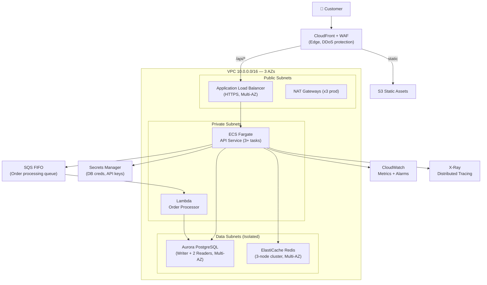

# E-Commerce Platform — Architecture & Design

## Overview

Multi-tier, highly available e-commerce backend on AWS. Designed for 99.99% uptime, horizontal scaling, and PCI-DSS readiness.

## Architecture Diagram



## Design Decisions

### Why ECS Fargate over EC2?
- No node management overhead
- Per-task billing — cost efficient for variable load
- Native integration with ALB, Secrets Manager, CloudWatch
- Faster deployments with rolling updates + circuit breaker

### Why Aurora PostgreSQL over RDS?
- 5x throughput vs standard PostgreSQL
- Auto-scaling storage (10GB → 128TB)
- Global Database option for future multi-region
- Managed master password rotation via Secrets Manager

### Why ElastiCache Redis?
- Session storage (sub-millisecond latency)
- Product catalog caching
- Rate limiting counters
- Cart data with TTL

### Why CloudFront + WAF?
- Global edge caching reduces ALB load
- WAF blocks OWASP Top 10 at edge
- Rate limiting per IP
- DDoS protection via AWS Shield Standard

## Security Controls

| Layer | Control |
|-------|---------|
| Edge | CloudFront + WAF (OWASP rules, rate limiting) |
| Network | VPC with private subnets, NACLs, Security Groups |
| Compute | ECS task roles (least privilege), no SSH |
| Data | Aurora encrypted at rest (AES-256), TLS in transit |
| Secrets | Secrets Manager with automatic rotation |
| Audit | CloudTrail, VPC Flow Logs, ALB access logs |

## Scaling Strategy

```
Load Spike → CloudWatch Alarm (CPU > 70%)
          → ECS Auto Scaling adds tasks (60s cooldown)
          → Aurora Read Replicas absorb read traffic
          → ElastiCache absorbs repeated reads
          → SQS buffers order spikes for Lambda
```

## Cost Optimization

- FARGATE_SPOT for non-critical background workers (70% savings)
- Aurora Serverless v2 for dev/staging environments
- CloudFront caching reduces origin requests
- S3 Intelligent-Tiering for static assets

## Deployment

```bash
# Terraform
cd terraform
terraform init
terraform plan -var-file=terraform.tfvars
terraform apply

# CDK
cd cdk
npm install && npm run build
cdk deploy EcommerceStackProd

# CloudFormation
aws cloudformation deploy \
  --template-file cloudformation/vpc.yaml \
  --stack-name ecommerce-prod-vpc \
  --parameter-overrides Environment=prod
```

## References

- [ECS Best Practices](https://docs.aws.amazon.com/AmazonECS/latest/bestpracticesguide/)
- [Aurora Best Practices](https://docs.aws.amazon.com/AmazonRDS/latest/AuroraUserGuide/Aurora.BestPractices.html)
- [CloudFront Security](https://docs.aws.amazon.com/AmazonCloudFront/latest/DeveloperGuide/security.html)
- [AWS Well-Architected — Reliability](https://docs.aws.amazon.com/wellarchitected/latest/reliability-pillar/)
- [Terraform AWS ECS Module](https://github.com/terraform-aws-modules/terraform-aws-ecs)
- [CDK ECS Patterns](https://docs.aws.amazon.com/cdk/api/v2/docs/aws-cdk-lib.aws_ecs_patterns-readme.html)
