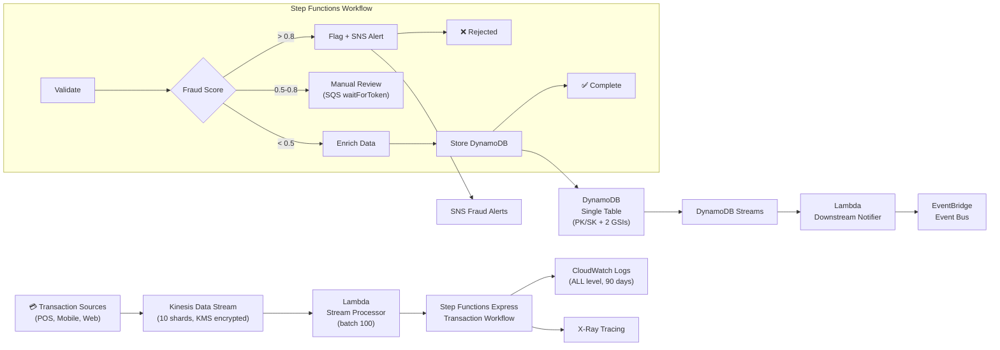

# FinTech Banking Pipeline — Architecture & Design

## Overview

Real-time financial transaction processing pipeline built for PCI-DSS compliance. Handles high-throughput transaction ingestion, fraud detection, enrichment, and storage using a fully serverless, event-driven architecture.

## Architecture Diagram



## PCI-DSS Compliance Controls

| Requirement | Implementation |
|-------------|----------------|
| Req 2: No defaults | All secrets in Secrets Manager, no hardcoded creds |
| Req 3: Protect stored data | DynamoDB encrypted with customer KMS key |
| Req 4: Encrypt in transit | TLS 1.2+ enforced on all endpoints |
| Req 6: Secure systems | Lambda in VPC, no public endpoints |
| Req 7: Restrict access | IAM least-privilege per function |
| Req 8: Identify users | CloudTrail + X-Ray for full audit trail |
| Req 10: Monitor access | CloudWatch Logs (90-day retention), VPC Flow Logs |
| Req 11: Test security | AWS Config rules, Security Hub |

## DynamoDB Single Table Design

```
Access Patterns:
  1. Get transaction by ID          → PK=TXN#<id>  SK=DATE#<ts>
  2. Get all transactions by user   → GSI1: PK=USER#<id> SK=TXN#<id>
  3. Get transactions by merchant   → GSI2: PK=MERCHANT#<id> SK=DATE#<ts>
  4. Get fraud records              → GSI1: PK=USER#<id> SK=STATUS#FRAUD#<ts>
```

## Fraud Detection Logic

```
Score 0.0 - 0.5  → Auto-approve, enrich, store
Score 0.5 - 0.8  → Manual review queue (SQS waitForTaskToken)
Score 0.8 - 1.0  → Auto-reject, SNS alert, store as FRAUD_DETECTED
```

## Throughput & Scaling

- Kinesis: 10 shards = 10,000 records/sec ingestion
- Lambda: 1000 concurrent executions (default), scales automatically
- Step Functions Express: 100,000 executions/sec
- DynamoDB: On-demand billing, no capacity planning needed

## Deployment

```bash
cd terraform
terraform init
terraform workspace new prod
terraform plan -var="environment=prod"
terraform apply
```

## References

- [Step Functions Best Practices](https://docs.aws.amazon.com/step-functions/latest/dg/bp-express.html)
- [DynamoDB Single Table Design](https://www.alexdebrie.com/posts/dynamodb-single-table/)
- [Kinesis Best Practices](https://docs.aws.amazon.com/streams/latest/dev/best-practices.html)
- [AWS Lambda Powertools](https://docs.powertools.aws.dev/lambda/python/)
- [PCI-DSS on AWS](https://aws.amazon.com/compliance/pci-dss-level-1-faqs/)
- [AWS Fraud Detector](https://aws.amazon.com/fraud-detector/)
