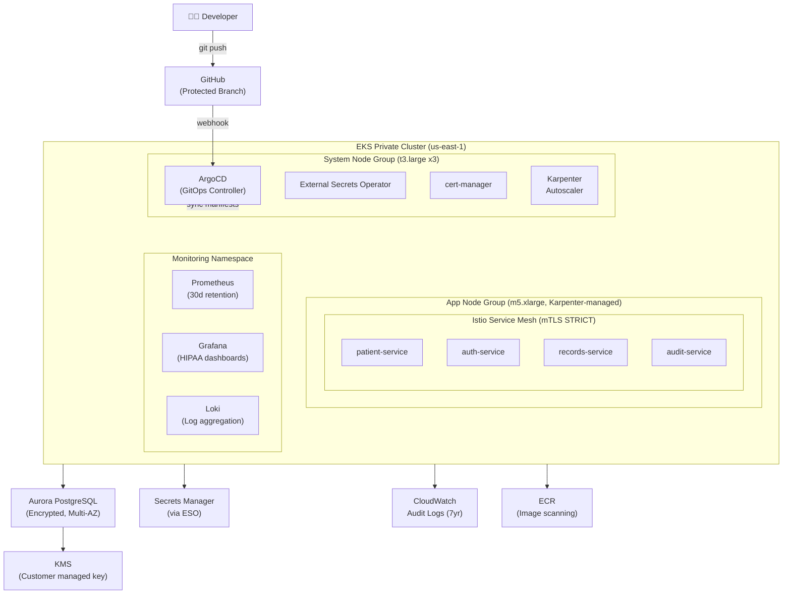

# Healthcare HIPAA Platform — Architecture & Design

## Overview

Production-grade EKS platform for healthcare workloads. Designed to meet HIPAA Technical Safeguards (45 CFR § 164.312) with GitOps delivery via ArgoCD, full observability, and zero-trust networking via Istio mTLS.

## Architecture Diagram



## HIPAA Technical Safeguards Mapping

| Safeguard | Requirement | Implementation |
|-----------|-------------|----------------|
| Access Control | Unique user identification | AWS SSO + ArgoCD RBAC |
| Access Control | Automatic logoff | Pod security policies, session timeouts |
| Audit Controls | Hardware/software activity | CloudTrail + EKS audit logs (7yr retention) |
| Integrity | PHI alteration/destruction | DynamoDB PITR, Aurora backups, S3 versioning |
| Transmission Security | Encryption in transit | Istio mTLS STRICT mode, TLS 1.2+ |
| Encryption at Rest | PHI storage | KMS-encrypted EBS, Aurora, Secrets Manager |

## Network Security

```
Internet → (blocked, private cluster)
VPN/Direct Connect → EKS API Server (private endpoint only)
Pods → Istio mTLS (STRICT mode, all namespaces)
Pods → AWS Services → VPC Endpoints (no internet traversal)
```

## GitOps Workflow

```
1. Developer opens PR → automated policy checks (OPA Gatekeeper)
2. PR merged to main → ArgoCD detects drift
3. ArgoCD syncs → Kubernetes applies manifests
4. Health checks pass → deployment complete
5. Rollback: git revert → ArgoCD auto-reverts
```

## Observability Stack

- Prometheus: metrics collection (all namespaces, 30-day retention)
- Grafana: dashboards (HIPAA compliance, SLO tracking)
- Loki: log aggregation (structured JSON logs)
- X-Ray: distributed tracing via AWS Distro for OpenTelemetry

## Deployment

```bash
# Bootstrap
cd terraform
terraform init
terraform apply -target=module.vpc
terraform apply -target=module.eks
terraform apply  # remaining resources

# Verify cluster
aws eks update-kubeconfig --name healthcare-prod --region us-east-1
kubectl get nodes
kubectl get pods -n argocd

# ArgoCD login
kubectl port-forward svc/argocd-server -n argocd 8080:443
argocd login localhost:8080
```

## References

- [EKS Best Practices — Security](https://aws.github.io/aws-eks-best-practices/security/docs/)
- [HIPAA on AWS Whitepaper](https://docs.aws.amazon.com/whitepapers/latest/architecting-hipaa-security-and-compliance-on-aws/)
- [Terraform EKS Module](https://github.com/terraform-aws-modules/terraform-aws-eks)
- [ArgoCD Docs](https://argo-cd.readthedocs.io/)
- [Karpenter Docs](https://karpenter.sh/)
- [Istio Security](https://istio.io/latest/docs/concepts/security/)
- [External Secrets Operator](https://external-secrets.io/)
- [AWS HIPAA Eligible Services](https://aws.amazon.com/compliance/hipaa-eligible-services-reference/)
