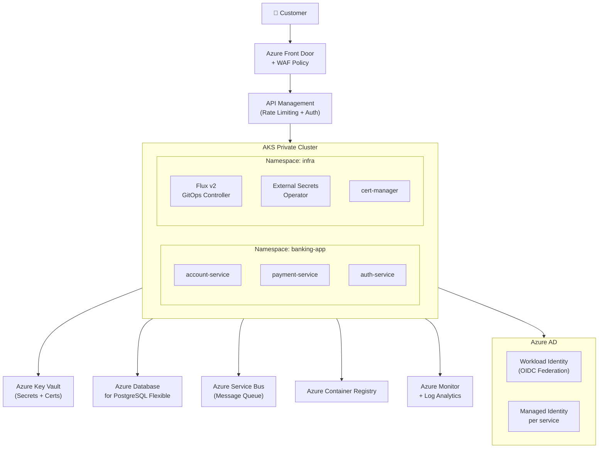
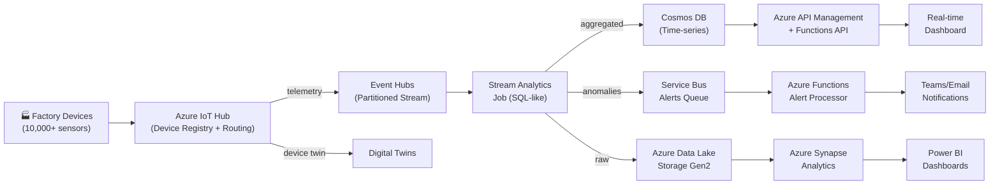
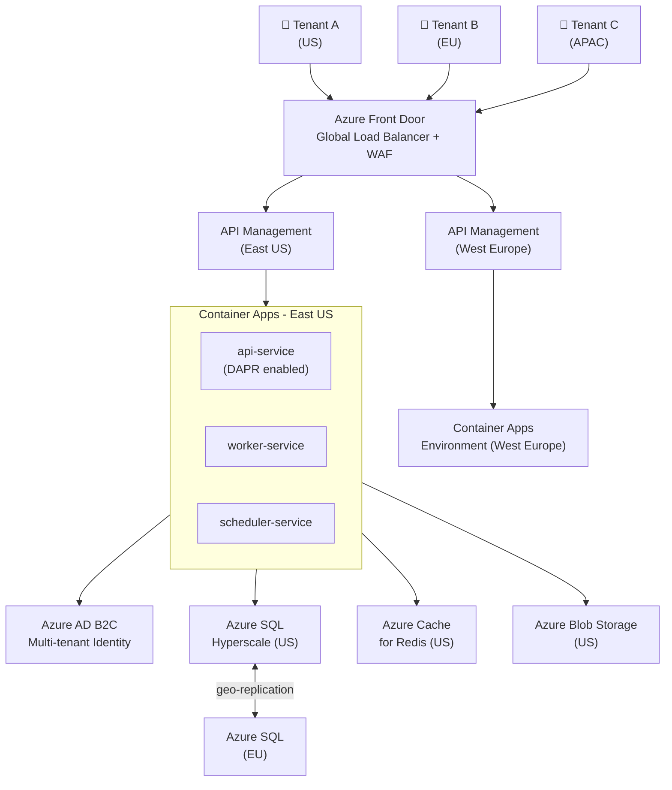

# Azure IaC Industry Projects

---

## Project 1: Enterprise Banking App on AKS (Banking Industry)

### Goal
Deploy a PCI-DSS aligned banking application on Azure Kubernetes Service with Azure AD Workload Identity, Key Vault integration, Azure Front Door, and full GitOps using Flux v2 — provisioned with Bicep + Terraform.

### Learning Outcomes
- Provision AKS with Azure CNI and private cluster configuration
- Implement Azure AD Workload Identity for pod-level auth
- Integrate Azure Key Vault via CSI driver
- Deploy Azure Front Door with WAF for global load balancing
- Set up Flux v2 GitOps with multi-tenancy

### Architecture Diagram



### Project Structure

```
azure-banking-platform/
├── infra/
│   ├── bicep/
│   │   ├── main.bicep
│   │   ├── modules/
│   │   │   ├── aks.bicep
│   │   │   ├── keyvault.bicep
│   │   │   ├── postgresql.bicep
│   │   │   └── frontdoor.bicep
│   │   └── parameters/
│   │       ├── dev.bicepparam
│   │       └── prod.bicepparam
│   └── terraform/
│       ├── main.tf
│       └── modules/
├── gitops/
│   ├── clusters/
│   │   └── prod/
│   │       ├── flux-system/
│   │       └── apps/
│   └── apps/
│       ├── account-service/
│       └── payment-service/
└── .github/
    └── workflows/
        └── deploy.yml
```

### Core Bicep Code

```bicep
// infra/bicep/main.bicep
targetScope = 'subscription'

@description('Environment name')
@allowed(['dev', 'staging', 'prod'])
param environment string

@description('Azure region')
param location string = 'eastus'

@description('Project name')
param projectName string = 'banking'

var resourceGroupName = '${projectName}-${environment}-rg'
var tags = {
  environment: environment
  project: projectName
  managedBy: 'bicep'
}

resource rg 'Microsoft.Resources/resourceGroups@2023-07-01' = {
  name: resourceGroupName
  location: location
  tags: tags
}

module network 'modules/network.bicep' = {
  name: 'network'
  scope: rg
  params: {
    vnetName: '${projectName}-${environment}-vnet'
    location: location
    tags: tags
  }
}

module aks 'modules/aks.bicep' = {
  name: 'aks'
  scope: rg
  params: {
    clusterName: '${projectName}-${environment}-aks'
    location: location
    subnetId: network.outputs.aksSubnetId
    tags: tags
  }
}

module keyVault 'modules/keyvault.bicep' = {
  name: 'keyvault'
  scope: rg
  params: {
    keyVaultName: '${projectName}-${environment}-kv'
    location: location
    aksKubeletIdentityObjectId: aks.outputs.kubeletIdentityObjectId
    tags: tags
  }
}

module postgresql 'modules/postgresql.bicep' = {
  name: 'postgresql'
  scope: rg
  params: {
    serverName: '${projectName}-${environment}-psql'
    location: location
    subnetId: network.outputs.dataSubnetId
    tags: tags
  }
}
```

```bicep
// infra/bicep/modules/aks.bicep
@description('AKS cluster name')
param clusterName string

param location string
param subnetId string
param tags object

@description('Kubernetes version')
param kubernetesVersion string = '1.29'

resource aksCluster 'Microsoft.ContainerService/managedClusters@2024-01-01' = {
  name: clusterName
  location: location
  tags: tags
  identity: {
    type: 'SystemAssigned'
  }
  properties: {
    kubernetesVersion: kubernetesVersion
    dnsPrefix: clusterName
    enableRBAC: true

    // Private cluster
    apiServerAccessProfile: {
      enablePrivateCluster: true
      privateDNSZone: 'system'
    }

    agentPoolProfiles: [
      {
        name: 'system'
        count: 3
        vmSize: 'Standard_D4s_v3'
        osType: 'Linux'
        mode: 'System'
        vnetSubnetID: subnetId
        enableAutoScaling: true
        minCount: 3
        maxCount: 5
        nodeTaints: ['CriticalAddonsOnly=true:NoSchedule']
      }
      {
        name: 'apppool'
        count: 3
        vmSize: 'Standard_D8s_v3'
        osType: 'Linux'
        mode: 'User'
        vnetSubnetID: subnetId
        enableAutoScaling: true
        minCount: 2
        maxCount: 20
      }
    ]

    networkProfile: {
      networkPlugin: 'azure'
      networkPolicy: 'azure'
      loadBalancerSku: 'standard'
    }

    addonProfiles: {
      azureKeyvaultSecretsProvider: {
        enabled: true
        config: {
          enableSecretRotation: 'true'
          rotationPollInterval: '2m'
        }
      }
      omsAgent: {
        enabled: true
        config: {
          logAnalyticsWorkspaceResourceID: logAnalyticsWorkspace.id
        }
      }
    }

    oidcIssuerProfile: {
      enabled: true
    }

    securityProfile: {
      workloadIdentity: {
        enabled: true
      }
      imageCleaner: {
        enabled: true
        intervalHours: 48
      }
    }
  }
}

resource logAnalyticsWorkspace 'Microsoft.OperationalInsights/workspaces@2022-10-01' = {
  name: '${clusterName}-law'
  location: location
  tags: tags
  properties: {
    sku: { name: 'PerGB2018' }
    retentionInDays: 90
  }
}

output clusterName string = aksCluster.name
output kubeletIdentityObjectId string = aksCluster.properties.identityProfile.kubeletidentity.objectId
output oidcIssuerUrl string = aksCluster.properties.oidcIssuerProfile.issuerURL
```

```yaml
# gitops/clusters/prod/flux-system/gotk-sync.yaml
apiVersion: source.toolkit.fluxcd.io/v1
kind: GitRepository
metadata:
  name: banking-platform
  namespace: flux-system
spec:
  interval: 1m
  url: https://github.com/org/banking-platform
  ref:
    branch: main
  secretRef:
    name: flux-system
---
apiVersion: kustomize.toolkit.fluxcd.io/v1
kind: Kustomization
metadata:
  name: apps
  namespace: flux-system
spec:
  interval: 10m
  path: ./gitops/apps
  prune: true
  sourceRef:
    kind: GitRepository
    name: banking-platform
  healthChecks:
    - apiVersion: apps/v1
      kind: Deployment
      name: account-service
      namespace: banking-app
```

### References
- [AKS Best Practices](https://learn.microsoft.com/en-us/azure/aks/best-practices)
- [Bicep AKS Module](https://github.com/Azure/bicep-registry-modules/tree/main/avm/res/container-service/managed-cluster)
- [Flux v2 Docs](https://fluxcd.io/flux/)
- [Azure Workload Identity](https://azure.github.io/azure-workload-identity/)
- [AKS Baseline Architecture](https://github.com/mspnp/aks-baseline)

---

## Project 2: Serverless IoT Data Platform (Manufacturing Industry)

### Goal
Build a real-time IoT telemetry ingestion and analytics platform using Azure IoT Hub, Event Hubs, Stream Analytics, Azure Functions, and Cosmos DB — deployed with Terraform.

### Learning Outcomes
- Design IoT Hub device management and routing
- Process streaming data with Azure Stream Analytics
- Store time-series data in Cosmos DB with TTL
- Build serverless processing with Azure Functions
- Visualize with Power BI Embedded

### Architecture Diagram



### Core Terraform Code

```hcl
# terraform/main.tf
resource "azurerm_resource_group" "iot" {
  name     = "${var.project}-iot-${var.environment}-rg"
  location = var.location
  tags     = var.common_tags
}

resource "azurerm_iothub" "main" {
  name                = "${var.project}-iothub-${var.environment}"
  resource_group_name = azurerm_resource_group.iot.name
  location            = azurerm_resource_group.iot.location

  sku {
    name     = "S1"
    capacity = 10
  }

  endpoint {
    type                       = "AzureIotHub.EventHub"
    connection_string          = azurerm_eventhub_authorization_rule.iothub.primary_connection_string
    name                       = "telemetry-eh"
    batch_frequency_in_seconds = 60
    max_chunk_size_in_bytes    = 314572800
  }

  route {
    name           = "telemetry-route"
    source         = "DeviceMessages"
    condition      = "true"
    endpoint_names = ["telemetry-eh"]
    enabled        = true
  }

  tags = var.common_tags
}

resource "azurerm_eventhub_namespace" "main" {
  name                = "${var.project}-ehns-${var.environment}"
  resource_group_name = azurerm_resource_group.iot.name
  location            = azurerm_resource_group.iot.location
  sku                 = "Standard"
  capacity            = 4
  auto_inflate_enabled     = true
  maximum_throughput_units = 20
  tags                     = var.common_tags
}

resource "azurerm_eventhub" "telemetry" {
  name                = "telemetry"
  namespace_name      = azurerm_eventhub_namespace.main.name
  resource_group_name = azurerm_resource_group.iot.name
  partition_count     = 32
  message_retention   = 7
}

resource "azurerm_cosmosdb_account" "main" {
  name                = "${var.project}-cosmos-${var.environment}"
  resource_group_name = azurerm_resource_group.iot.name
  location            = azurerm_resource_group.iot.location
  offer_type          = "Standard"
  kind                = "GlobalDocumentDB"

  consistency_policy {
    consistency_level = "Session"
  }

  geo_location {
    location          = var.location
    failover_priority = 0
  }

  geo_location {
    location          = var.secondary_location
    failover_priority = 1
  }

  capabilities {
    name = "EnableServerless"
  }

  tags = var.common_tags
}

resource "azurerm_stream_analytics_job" "telemetry" {
  name                                     = "${var.project}-asa-${var.environment}"
  resource_group_name                      = azurerm_resource_group.iot.name
  location                                 = azurerm_resource_group.iot.location
  compatibility_level                      = "1.2"
  data_locale                              = "en-GB"
  events_late_arrival_max_delay_in_seconds = 60
  events_out_of_order_max_delay_in_seconds = 50
  events_out_of_order_policy               = "Adjust"
  output_error_policy                      = "Drop"
  streaming_units                          = 6

  transformation_query = <<-QUERY
    SELECT
      deviceId,
      AVG(temperature) AS avgTemp,
      MAX(temperature) AS maxTemp,
      MIN(temperature) AS minTemp,
      AVG(humidity) AS avgHumidity,
      System.Timestamp() AS windowEnd,
      COUNT(*) AS readingCount
    INTO [cosmos-output]
    FROM [eventhub-input] TIMESTAMP BY enqueuedTime
    GROUP BY deviceId, TumblingWindow(minute, 5)

    SELECT *
    INTO [alerts-output]
    FROM [eventhub-input] TIMESTAMP BY enqueuedTime
    WHERE temperature > 85 OR temperature < -10
  QUERY

  tags = var.common_tags
}
```

### References
- [Azure IoT Hub Docs](https://learn.microsoft.com/en-us/azure/iot-hub/)
- [Stream Analytics Docs](https://learn.microsoft.com/en-us/azure/stream-analytics/)
- [Terraform Azure IoT](https://registry.terraform.io/providers/hashicorp/azurerm/latest/docs/resources/iothub)
- [Azure IoT Reference Architecture](https://learn.microsoft.com/en-us/azure/architecture/reference-architectures/iot)
- [Cosmos DB Best Practices](https://learn.microsoft.com/en-us/azure/cosmos-db/best-practice-dotnet)

---

## Project 3: Multi-Region SaaS Platform on Azure Container Apps (SaaS Industry)

### Goal
Deploy a multi-tenant SaaS application using Azure Container Apps, Azure Front Door for global routing, Azure AD B2C for identity, and Azure API Management — using Bicep with GitHub Actions.

### Learning Outcomes
- Design multi-region active-active architecture
- Implement Azure Container Apps with DAPR
- Configure Azure AD B2C for multi-tenant identity
- Use Azure API Management for API gateway patterns
- Implement blue-green deployments with traffic splitting

### Architecture Diagram



### Core Bicep Code

```bicep
// infra/bicep/modules/container-apps.bicep
param environmentName string
param location string
param subnetId string
param logAnalyticsWorkspaceId string
param tags object

resource containerAppsEnvironment 'Microsoft.App/managedEnvironments@2023-11-02-preview' = {
  name: environmentName
  location: location
  tags: tags
  properties: {
    appLogsConfiguration: {
      destination: 'log-analytics'
      logAnalyticsConfiguration: {
        customerId: reference(logAnalyticsWorkspaceId, '2022-10-01').customerId
        sharedKey: listKeys(logAnalyticsWorkspaceId, '2022-10-01').primarySharedKey
      }
    }
    vnetConfiguration: {
      infrastructureSubnetId: subnetId
      internal: true
    }
    daprAIInstrumentationKey: appInsights.properties.InstrumentationKey
    workloadProfiles: [
      {
        name: 'Consumption'
        workloadProfileType: 'Consumption'
      }
      {
        name: 'D4'
        workloadProfileType: 'D4'
        minimumCount: 2
        maximumCount: 20
      }
    ]
  }
}

resource apiContainerApp 'Microsoft.App/containerApps@2023-11-02-preview' = {
  name: 'api-service'
  location: location
  tags: tags
  properties: {
    managedEnvironmentId: containerAppsEnvironment.id
    workloadProfileName: 'D4'
    configuration: {
      ingress: {
        external: false
        targetPort: 3000
        traffic: [
          { latestRevision: true, weight: 90, label: 'current' }
          { revisionName: 'api-service--prev', weight: 10, label: 'previous' }
        ]
      }
      dapr: {
        enabled: true
        appId: 'api-service'
        appPort: 3000
        httpReadBufferSize: 4
      }
      secrets: [
        {
          name: 'db-connection'
          keyVaultUrl: 'https://${keyVaultName}.vault.azure.net/secrets/db-connection'
          identity: 'system'
        }
      ]
    }
    template: {
      containers: [
        {
          name: 'api'
          image: '${acrName}.azurecr.io/api-service:${imageTag}'
          resources: {
            cpu: json('2.0')
            memory: '4Gi'
          }
          env: [
            { name: 'NODE_ENV', value: 'production' }
            { name: 'DB_CONNECTION', secretRef: 'db-connection' }
          ]
          probes: [
            {
              type: 'Liveness'
              httpGet: { path: '/health', port: 3000 }
              initialDelaySeconds: 10
              periodSeconds: 30
            }
          ]
        }
      ]
      scale: {
        minReplicas: 2
        maxReplicas: 50
        rules: [
          {
            name: 'http-scaling'
            http: { metadata: { concurrentRequests: '100' } }
          }
        ]
      }
    }
  }
}

resource appInsights 'Microsoft.Insights/components@2020-02-02' = {
  name: '${environmentName}-ai'
  location: location
  kind: 'web'
  properties: {
    Application_Type: 'web'
    WorkspaceResourceId: logAnalyticsWorkspaceId
  }
}

output environmentId string = containerAppsEnvironment.id
output apiServiceFqdn string = apiContainerApp.properties.configuration.ingress.fqdn
```

### References
- [Azure Container Apps Docs](https://learn.microsoft.com/en-us/azure/container-apps/)
- [DAPR on Container Apps](https://learn.microsoft.com/en-us/azure/container-apps/dapr-overview)
- [Azure AD B2C Docs](https://learn.microsoft.com/en-us/azure/active-directory-b2c/)
- [Azure Front Door Docs](https://learn.microsoft.com/en-us/azure/frontdoor/)
- [Container Apps Bicep Samples](https://github.com/Azure-Samples/container-apps-store-api-microservice)
- [Azure SaaS Dev Kit](https://github.com/Azure/azure-saas)
