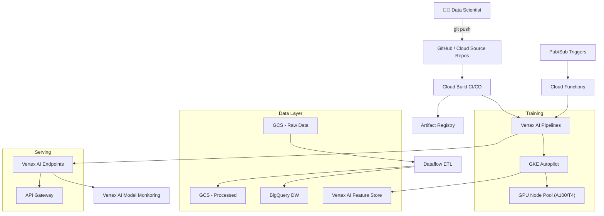
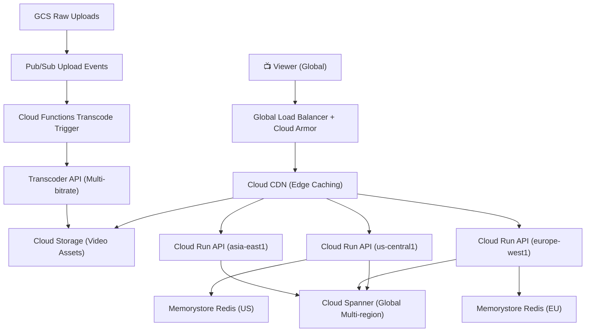
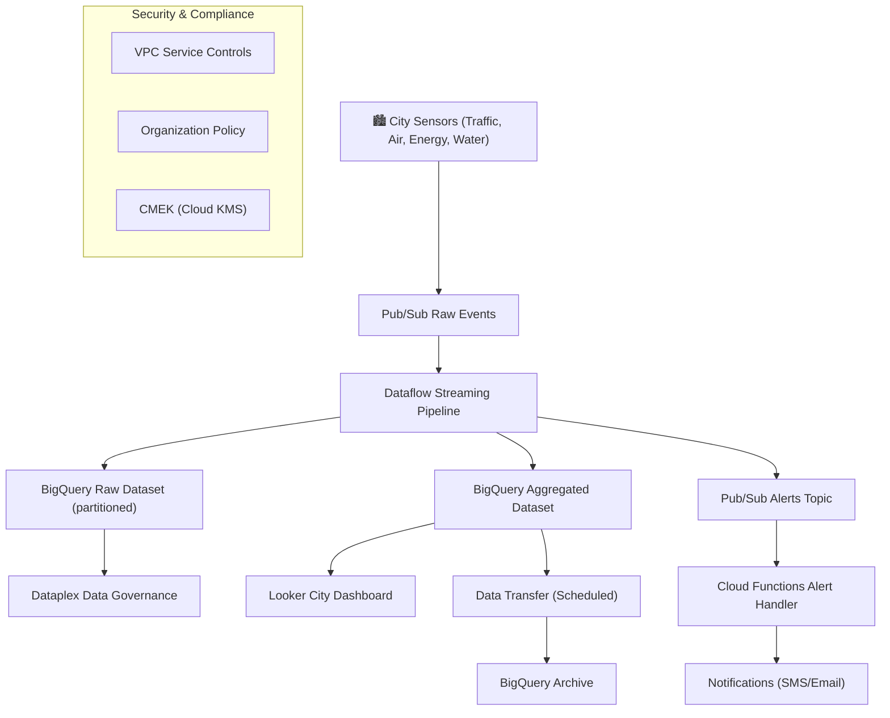

# GCP IaC Industry Projects

---

## Project 1: ML Training & Serving Platform (AI/ML Industry)

### Goal
Build a production ML platform on GCP using GKE, Vertex AI, Cloud Storage, BigQuery, and Pub/Sub — provisioned with Terraform and deployed via Cloud Build GitOps pipeline.

### Learning Outcomes
- Provision GKE Autopilot for ML workloads
- Integrate Vertex AI Pipelines with Kubeflow
- Design data lake with BigQuery + GCS
- Implement Pub/Sub for event-driven ML triggers
- Set up Cloud Build CI/CD with Artifact Registry

### Architecture Diagram



### Project Structure

```
gcp-ml-platform/
├── terraform/
│   ├── environments/
│   │   ├── dev/
│   │   └── prod/
│   ├── modules/
│   │   ├── gke/
│   │   ├── vertex-ai/
│   │   ├── bigquery/
│   │   └── pubsub/
│   └── foundation/
├── cloudbuild/
│   └── cloudbuild.yaml
├── pipelines/
│   ├── training/pipeline.py
│   └── serving/deploy.py
└── k8s/
    └── training-jobs/
```

### Core Terraform Code

```hcl
# terraform/modules/gke/main.tf
resource "google_container_cluster" "ml_cluster" {
  name             = "${var.project_name}-ml-cluster"
  location         = var.region
  project          = var.project_id
  enable_autopilot = true

  network    = var.network_name
  subnetwork = var.subnet_name

  ip_allocation_policy {
    cluster_secondary_range_name  = "pods"
    services_secondary_range_name = "services"
  }

  private_cluster_config {
    enable_private_nodes    = true
    enable_private_endpoint = false
    master_ipv4_cidr_block  = "172.16.0.0/28"
  }

  workload_identity_config {
    workload_pool = "${var.project_id}.svc.id.goog"
  }

  binary_authorization {
    evaluation_mode = "PROJECT_SINGLETON_POLICY_ENFORCE"
  }

  release_channel { channel = "REGULAR" }

  monitoring_config {
    enable_components = ["SYSTEM_COMPONENTS", "WORKLOADS"]
    managed_prometheus { enabled = true }
  }
}

resource "google_bigquery_dataset" "ml_data" {
  dataset_id  = "ml_data_${var.environment}"
  project     = var.project_id
  location    = var.location

  default_encryption_configuration {
    kms_key_name = var.kms_key_name
  }
}

resource "google_bigquery_table" "features" {
  dataset_id = google_bigquery_dataset.ml_data.dataset_id
  table_id   = "feature_store"
  project    = var.project_id

  time_partitioning {
    type  = "DAY"
    field = "event_timestamp"
  }

  clustering = ["entity_id", "feature_name"]

  schema = jsonencode([
    { name = "entity_id",      type = "STRING",    mode = "REQUIRED" },
    { name = "feature_name",   type = "STRING",    mode = "REQUIRED" },
    { name = "feature_value",  type = "FLOAT64",   mode = "NULLABLE" },
    { name = "event_timestamp",type = "TIMESTAMP", mode = "REQUIRED" }
  ])

  deletion_protection = true
}
```

```python
# pipelines/training/pipeline.py
from kfp import dsl
from kfp.v2 import compiler
import google.cloud.aiplatform as aip

@dsl.component(
    base_image="python:3.11",
    packages_to_install=["pandas", "scikit-learn", "google-cloud-bigquery"]
)
def load_data(project_id: str, dataset: str, output_path: dsl.Output[dsl.Dataset]):
    from google.cloud import bigquery
    client = bigquery.Client(project=project_id)
    query = f"SELECT * FROM `{project_id}.{dataset}.feature_store` LIMIT 100000"
    df = client.query(query).to_dataframe()
    df.to_csv(output_path.path, index=False)

@dsl.component(
    base_image="python:3.11",
    packages_to_install=["scikit-learn", "joblib"]
)
def train_model(
    data: dsl.Input[dsl.Dataset],
    model: dsl.Output[dsl.Model],
    metrics: dsl.Output[dsl.Metrics]
):
    import pandas as pd
    from sklearn.ensemble import GradientBoostingClassifier
    from sklearn.model_selection import train_test_split
    from sklearn.metrics import accuracy_score
    import joblib

    df = pd.read_csv(data.path)
    X, y = df.drop("label", axis=1), df["label"]
    X_train, X_test, y_train, y_test = train_test_split(X, y, test_size=0.2)
    clf = GradientBoostingClassifier(n_estimators=100)
    clf.fit(X_train, y_train)
    metrics.log_metric("accuracy", accuracy_score(y_test, clf.predict(X_test)))
    joblib.dump(clf, model.path + "/model.joblib")

@dsl.pipeline(name="ml-training-pipeline")
def training_pipeline(project_id: str, dataset: str):
    load_task = load_data(project_id=project_id, dataset=dataset)
    train_model(data=load_task.outputs["output_path"])
```

### References
- [Terraform GKE Module](https://github.com/terraform-google-modules/terraform-google-kubernetes-engine)
- [Vertex AI Docs](https://cloud.google.com/vertex-ai/docs)
- [Kubeflow Pipelines](https://www.kubeflow.org/docs/components/pipelines/)
- [GCP ML Best Practices](https://cloud.google.com/architecture/ml-on-gcp-best-practices)
- [BigQuery ML Docs](https://cloud.google.com/bigquery/docs/bqml-introduction)

---

## Project 2: Global Media Streaming Platform (Media & Entertainment)

### Goal
Deploy a globally distributed video streaming platform using GKE, Cloud CDN, Cloud Spanner, Memorystore, and Cloud Run — using Terraform with multi-region active-active setup.

### Learning Outcomes
- Design globally distributed architecture with Cloud Spanner
- Implement Cloud CDN with Cloud Armor DDoS protection
- Use Cloud Run for auto-scaling API services
- Configure Memorystore Redis for session caching
- Set up multi-region deployment with Traffic Director

### Architecture Diagram



### Core Terraform Code

```hcl
# terraform/modules/cloud-run/main.tf
resource "google_cloud_run_v2_service" "api" {
  name     = "${var.service_name}-${var.region}"
  location = var.region
  project  = var.project_id
  ingress  = "INGRESS_TRAFFIC_INTERNAL_LOAD_BALANCER"

  template {
    service_account = google_service_account.run_sa.email

    scaling {
      min_instance_count = 2
      max_instance_count = 1000
    }

    containers {
      image = "${var.region}-docker.pkg.dev/${var.project_id}/app/${var.service_name}:${var.image_tag}"

      resources {
        limits            = { cpu = "4", memory = "8Gi" }
        cpu_idle          = false
        startup_cpu_boost = true
      }

      liveness_probe {
        http_get { path = "/health" }
        initial_delay_seconds = 10
        period_seconds        = 30
      }
    }

    vpc_access {
      connector = google_vpc_access_connector.connector.id
      egress    = "PRIVATE_RANGES_ONLY"
    }
  }
}

resource "google_spanner_instance" "main" {
  name         = "${var.project_name}-spanner"
  config       = "nam-eur-asia1"
  display_name = "Media Platform DB"
  project      = var.project_id

  autoscaling_config {
    autoscaling_limits {
      min_processing_units = 1000
      max_processing_units = 10000
    }
    autoscaling_targets {
      high_priority_cpu_utilization_percent = 65
      storage_utilization_percent           = 95
    }
  }
}

resource "google_spanner_database" "media" {
  instance = google_spanner_instance.main.name
  name     = "media-db"
  project  = var.project_id

  ddl = [
    <<-DDL
      CREATE TABLE Videos (
        VideoId STRING(36) NOT NULL,
        Title STRING(500) NOT NULL,
        DurationSeconds INT64 NOT NULL,
        Status STRING(20) NOT NULL,
        CreatedAt TIMESTAMP NOT NULL OPTIONS (allow_commit_timestamp=true),
        ManifestUrl STRING(1000)
      ) PRIMARY KEY (VideoId)
    DDL
    ,
    "CREATE INDEX VideosByStatus ON Videos(Status, CreatedAt DESC)"
  ]

  deletion_protection = true
}

resource "google_compute_security_policy" "armor" {
  name    = "media-armor-policy"
  project = var.project_id

  adaptive_protection_config {
    layer_7_ddos_defense_config {
      enable          = true
      rule_visibility = "STANDARD"
    }
  }

  rule {
    action   = "rate_based_ban"
    priority = 1000
    match {
      versioned_expr = "SRC_IPS_V1"
      config { src_ip_ranges = ["*"] }
    }
    rate_limit_options {
      rate_limit_threshold { count = 1000; interval_sec = 60 }
      ban_duration_sec = 300
    }
    description = "Rate limit all IPs"
  }

  rule {
    action   = "allow"
    priority = 2147483647
    match {
      versioned_expr = "SRC_IPS_V1"
      config { src_ip_ranges = ["*"] }
    }
  }
}
```

### References
- [Cloud Run Docs](https://cloud.google.com/run/docs)
- [Cloud Spanner Docs](https://cloud.google.com/spanner/docs)
- [Cloud CDN Docs](https://cloud.google.com/cdn/docs)
- [Cloud Armor Docs](https://cloud.google.com/armor/docs)
- [Terraform Cloud Run Module](https://github.com/GoogleCloudPlatform/terraform-google-cloud-run)
- [GCP Media Solutions](https://cloud.google.com/solutions/media-entertainment)

---

## Project 3: Smart City Data Platform (Government / Smart City)

### Goal
Build a city-scale data platform ingesting IoT sensor data (traffic, air quality, energy) using Pub/Sub, Dataflow, BigQuery, and Looker — with full IaC via Terraform and Cloud Foundation Fabric patterns.

### Learning Outcomes
- Design large-scale streaming ingestion with Pub/Sub + Dataflow
- Implement BigQuery data warehouse with partitioning and clustering
- Apply GCP Organization Policy and VPC Service Controls for compliance
- Use Looker for operational dashboards
- Implement data governance with Dataplex

### Architecture Diagram



### Core Terraform Code

```hcl
# terraform/main.tf
resource "google_pubsub_topic" "sensor_data" {
  for_each = toset(["traffic", "air-quality", "energy", "water"])

  name    = "city-sensors-${each.key}"
  project = var.project_id

  message_retention_duration = "86600s"

  schema_settings {
    schema   = google_pubsub_schema.sensor_schema.id
    encoding = "JSON"
  }

  kms_key_name = google_kms_crypto_key.pubsub_key.id
}

resource "google_pubsub_schema" "sensor_schema" {
  name    = "sensor-data-schema"
  project = var.project_id
  type    = "AVRO"
  definition = jsonencode({
    type = "record"
    name = "SensorReading"
    fields = [
      { name = "sensor_id",   type = "string" },
      { name = "sensor_type", type = "string" },
      { name = "value",       type = "double" },
      { name = "unit",        type = "string" },
      { name = "timestamp",   type = { type = "long", logicalType = "timestamp-micros" } }
    ]
  })
}

resource "google_bigquery_dataset" "city_raw" {
  dataset_id  = "city_sensors_raw"
  project     = var.project_id
  location    = var.location

  default_encryption_configuration {
    kms_key_name = google_kms_crypto_key.bq_key.id
  }

  default_partition_expiration_ms = 7776000000  # 90 days
}

resource "google_bigquery_table" "sensor_readings" {
  dataset_id = google_bigquery_dataset.city_raw.dataset_id
  table_id   = "sensor_readings"
  project    = var.project_id

  time_partitioning {
    type  = "DAY"
    field = "timestamp"
  }

  clustering = ["sensor_type", "sensor_id"]

  schema = jsonencode([
    { name = "sensor_id",      type = "STRING",    mode = "REQUIRED" },
    { name = "sensor_type",    type = "STRING",    mode = "REQUIRED" },
    { name = "value",          type = "FLOAT64",   mode = "REQUIRED" },
    { name = "unit",           type = "STRING",    mode = "REQUIRED" },
    { name = "timestamp",      type = "TIMESTAMP", mode = "REQUIRED" },
    { name = "location",       type = "GEOGRAPHY", mode = "NULLABLE" },
    { name = "ingestion_time", type = "TIMESTAMP", mode = "REQUIRED" }
  ])

  deletion_protection = true
}

resource "google_access_context_manager_service_perimeter" "city_perimeter" {
  parent = "accessPolicies/${var.access_policy_id}"
  name   = "accessPolicies/${var.access_policy_id}/servicePerimeters/city_data_perimeter"
  title  = "City Data Perimeter"

  spec {
    resources           = ["projects/${var.project_number}"]
    restricted_services = [
      "bigquery.googleapis.com",
      "storage.googleapis.com",
      "pubsub.googleapis.com"
    ]
    access_levels = [google_access_context_manager_access_level.corporate.name]
  }
}
```

### References
- [Terraform Pub/Sub Module](https://github.com/terraform-google-modules/terraform-google-pubsub)
- [Terraform BigQuery Module](https://github.com/terraform-google-modules/terraform-google-bigquery)
- [Dataflow Templates](https://github.com/GoogleCloudPlatform/DataflowTemplates)
- [Cloud Foundation Fabric](https://github.com/GoogleCloudPlatform/cloud-foundation-fabric)
- [GCP Smart City Reference](https://cloud.google.com/solutions/smart-cities)
- [Dataplex Docs](https://cloud.google.com/dataplex/docs)
- [VPC Service Controls](https://cloud.google.com/vpc-service-controls/docs)
